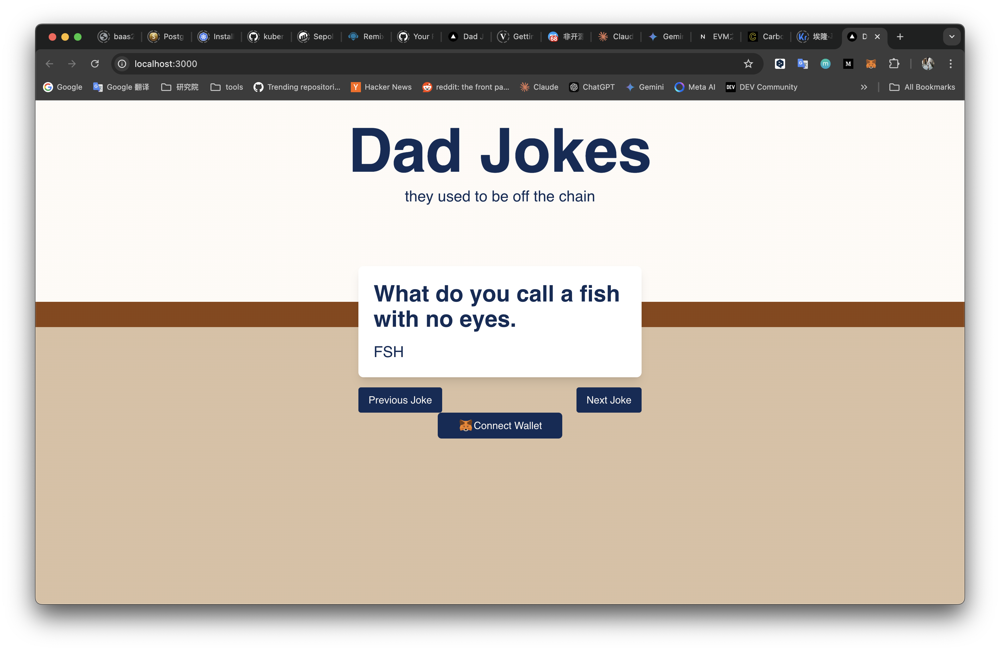

# DadJokesDApp
A step-by-step developer tutorial that guides you through building a fully-functional dad joke dApp with Next.js, Tailwind CSS, a smart contract, and Viem, and deploying it on Sepolia.


## DadJoke.sol
[DadJoke.sol](contracts/DadJoke.sol)

## Building Nextjs Front-end

```
➜ npx create-next-app@latest
Need to install the following packages:
create-next-app@14.2.14
Ok to proceed? (y) y

✔ What is your project named? … dad-jokes
✔ Would you like to use TypeScript? … No / Yes
✔ Would you like to use ESLint? … No / Yes
✔ Would you like to use Tailwind CSS? … No / Yes
✔ Would you like to use `src/` directory? … No / Yes
✔ Would you like to use App Router? (recommended) … No / Yes
✔ Would you like to customize the default import alias (@/*)? … No / Yes
Creating a new Next.js app in /home/chyiyaqing/chyi/github/DadJokesDApp/dad-jokes.

Using npm.

Initializing project with template: app-tw 


Installing dependencies:
- react
- react-dom
- next

Installing devDependencies:
- typescript
- @types/node
- @types/react
- @types/react-dom
- postcss
- tailwindcss
- eslint
- eslint-config-next

$ cd dad-jokes
$ npm run dev


# viem: Build reliable apps & libraries with lightweight composable, and type-safe modules that interface with Etherem.
$ npm install viem

```

[abi.json](contracts/output/DadJoke.abi)
DadJoke Contract Address: 0x2683167d86c33B45cc05ae94a834a29E967Ece70


## Set up

```
1. cd dad-jokes
2. npm run dev
```
